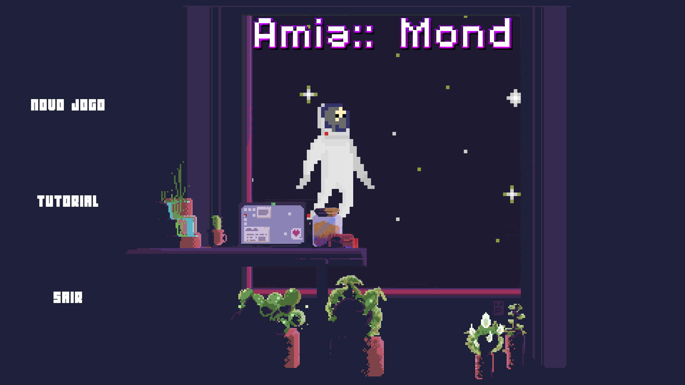
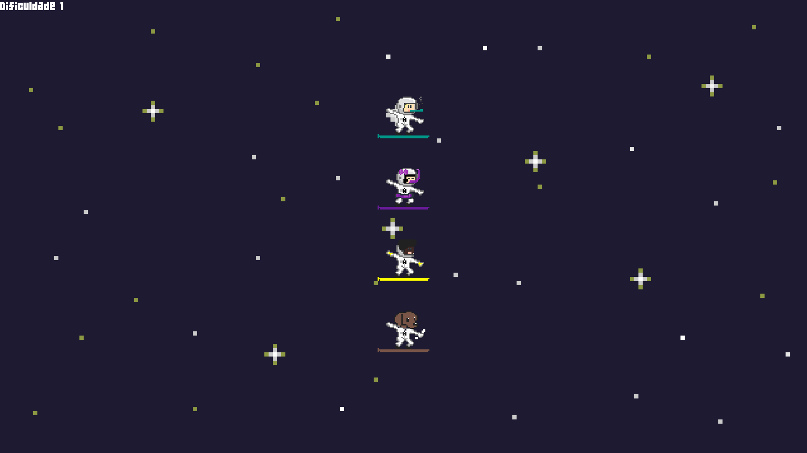
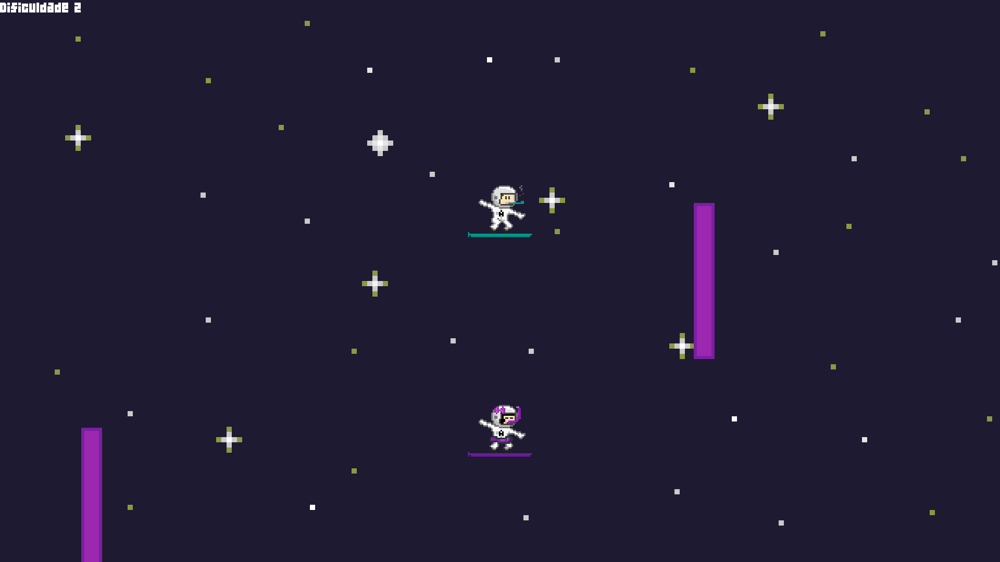

# Amia::Mond

Amia::Mond é um jogo de plataforma onde o objetivo é vencer os adversários em uma corrida de obstáculos. A jogabilidade é bastante simples: à cada jogador é designada uma tecla do teclado para controlar o movimento de seu personagem (para cima ou para baixo). O jogo é jogado por 2 ou mais jogadores (máximo de 4).

Este projeto foi desenvolvido como trabalho final da disciplina de Fundamentos de Programação 2. 
Criado por Victor Netto e Vinícius Couto.

## Compilando e executando

Um arquivo Makefile é fornecido para a compilação do projeto. Com `make` instalado no sistema, basta acessar o diretório do projeto e executar o comando `make all`.
O processo de compilação será iniciado e, assim que concluído, o arquivo `amia` será criado. Para iniciar o jogo, basta executar o arquivo binário: `./amia`.

Um breve tutorial pode ser acessado através do menu principal explicando o funcionamento do jogo e seus controles.

Nota: O projeto depende da biblioteca SFML (versão 2.x) e, por padrão, faz-se uso do G++ para compilá-lo.

## Screenshots

